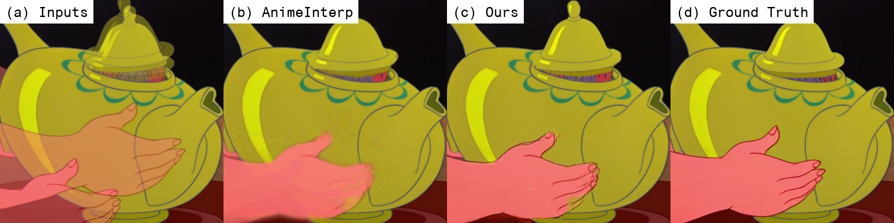

eisai-anime-interpolator
========================

**Improving the Perceptual Quality of 2D Animation Interpolation**  
Shuhong Chen[\*](https://shuhongchen.github.io/), Matthias Zwicker[\*](https://www.cs.umd.edu/~zwicker/)  
ECCV2022  
\[[arxiv](https://arxiv.org/abs/2111.12792)\]
\[[github](https://github.com/ShuhongChen/eisai-anime-interpolator)\]
\[[colab](https://colab.research.google.com/github/ShuhongChen/eisai-anime-interpolator/blob/master/_notebooks/eisai_colab_demo.ipynb)\]  

*Traditional 2D animation is labor-intensive, often requiring animators to manually draw twelve illustrations per second of movement.  While automatic frame interpolation may ease this burden, 2D animation poses additional difficulties compared to photorealistic video.  In this work, we address challenges unexplored in previous animation interpolation systems, with a focus on improving perceptual quality.  Firstly, we propose SoftsplatLite (SSL), a forward-warping interpolation architecture with fewer trainable parameters and better perceptual performance.  Secondly, we design a Distance Transform Module (DTM) that leverages line proximity cues to correct aberrations in difficult solid-color regions.  Thirdly, we define a Restricted Relative Linear Discrepancy metric (RRLD) to automate the previously manual training data collection process.  Lastly, we explore evaluation of 2D animation generation through a user study, and establish that the LPIPS perceptual metric and chamfer line distance (CD) are more appropriate measures of quality than PSNR and SSIM used in prior art.*

## colab demo

Notebook sets up colab and runs the [interpolation script](#interpolate-frames) below: [eisai_colab_demo.ipynb](https://colab.research.google.com/github/ShuhongChen/eisai-anime-interpolator/blob/master/_notebooks/eisai_colab_demo.ipynb)  

## download

Downloads can be found in this drive folder: [eccv2022_eisai_anime_interpolator_release](https://drive.google.com/drive/folders/1AiZVgGej7Tpn95ats6967neIEPdShxWy?usp=sharing)

* Download `checkpoints.zip` and extract to the root project directory; the `./checkpoints/` folder should contain the `.pt` files.  Note that `./checkpoints/anime_interp_full.ckpt` is the pretrained model downloaded from [AnimeInterp](https://github.com/lisiyao21/AnimeInterp).  The checkpoints are all you need for inference.
* For evaluation, download the ATD12k dataset from [AnimeInterp](https://github.com/lisiyao21/AnimeInterp) and our repacked flows `rfr_540p.zip` to create the file structure shown below.  Our repacked flows (SGM+RFR) are not the same as those in the AnimeInterp download (SGM only); it's a bit complicated to [hack](https://github.com/lisiyao21/AnimeInterp/blob/b38358335fcd7361a199c1f7d899d457724ecee0/test_anime_sequence_one_by_one.py#L127) the full SGM+RFR flows from their repo, so we include our zip as a convenience.

        # AnimeInterp file structure
        _data/atd12k/
            raw/
                test_2k_540p/  # raw image data from AnimeInterp repo
                    Disney_ ...
                    Japan_ ...
            preprocessed/
                rfr_540p/  # precomputed flow pickles
                    test/
                        Disney_ ...
                        Japan_ ...

While we can't release the new data collected in this work, our specific sources are listed in the paper supplementary, and our RRLD data collection pipeline is available below; this lets you either recreate our dataset or assemble your own datasets directly from source animations.

## setup

Make a copy of `./_env/machine_config.bashrc.template` to `./_env/machine_config.bashrc`, and set `$PROJECT_DN` to the absolute path of this repository folder.  The other variables are optional.

This project requires docker with a GPU.  Run these lines from the project directory to pull the image and enter a container; note these are bash scripts inside the `./make` folder, not `make` commands.  Alternatively, you can build the docker image yourself.

    make/docker_pull
    make/shell_docker
    # OR
    make/docker_build
    make/shell_docker

## evaluation

Run this line to reproduce the best-result metrics on ATD12k from our paper; the output should match up to precision differences (tested on GTX1080ti).

    python3 -m _scripts.evaluate

    #  subset metric  score      
    # ===========================
    #  all    lpips   3.4943E-02 
    #  all    chamfer 4.3505E-05 
    #  all    psnr         29.29 
    #  all    ssim         95.15 
    #  east   lpips   3.8260E-02 
    #  east   chamfer 4.9791E-05 
    #  west   lpips   3.2915E-02 
    #  west   chamfer 3.9660E-05

## interpolate frames

Run this line to interpolate frames between two given images:

    python3 -m _scripts.interpolate \
        /path/to/frame0.png \
        /path/to/frame1.png \
        --fps=12 \
        --out=./temp/interpolate_demo_output

> Note that this script uses RFR/RAFT flows without SGM initialization; please see our paper supplementary section on SGM computation tradeoffs.  Note also that due to package version differences, the RFR/RAFT flows here may be slightly different from the original AnimeInterp repo.

## rrld data pipeline

Run this line to extract training data from a source video using RRLD.  This script is all-in-one, consisting of: re-encoding, deduplication, RRLD filtering, triplet image extraction, and triplet flow estimation.

    bash ./_scripts/rrld_pipeline.sh \
        /path/to/video.mp4 \
        ./temp/rrld_demo_output

> Note that the flows here differ from our paper in that we use RFR/RAFT instead of [FlowNet2](https://github.com/NVIDIA/flownet2-pytorch).  This is done to simplify the repo; as discussed in the paper, RRLD is quite robust to choice of flow estimator.  Note also that unlike the paper, this script doesn't use [TransNetV2](https://github.com/soCzech/TransNetV2) to limit one sample per cut; this restriction can be reimposed by filtering `rrld.txt` before image extraction.

## training

Run this line to train on RRLD-extracted data:

    python3 -m _train.frame_interpolation.train \
        ./temp/rrld_demo_output \
        ./temp/training_demo_output

> Note that this script is starter code adapted from our experiments, using the same hyperparameters as our best-performing experiment.

## full user study

Download and extract [`user_study_full.zip`](https://drive.google.com/file/d/1HzcjJpBq0ILBDofY5nkNnzZhHxrK5HVO/view?usp=sharing) from the downloads drive folder, and open `index.html` in a browser supporting WEBP animations.  You must extract the zip for the display to work properly.

## citing

If you use our repo, please cite our work:

    @inproceedings{chen2022eisai,
        title={Improving the Perceptual Quality of 2D Animation Interpolation},
        author={Chen, Shuhong and Zwicker, Matthias},
        booktitle={Proceedings of the European Conference on Computer Vision},
        year={2022}
    }

